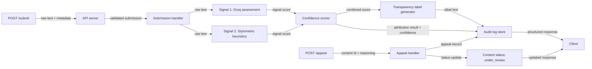

# Provenance Guard Plan

## Architecture

The system is a Flask API with three core layers: request handling, detection, and persistence. A piece of text enters through `POST /submit`, is checked by two distinct signals, gets a calibrated confidence score, and is converted into a reader-facing transparency label before the decision is written to the audit log and returned to the client.

1. A client sends the text to `POST /submit`.
2. The API layer validates the request, assigns a content id, and checks the rate limiter before any expensive work runs.
3. The submission service hands the raw text to the detection engine.
4. The detection engine runs two independent signals:
   - a Groq-backed language-model assessment that judges whether the text reads more like human writing or AI-generated writing
   - a stylometric heuristic analyzer that measures structural patterns such as sentence-length variance, punctuation density, vocabulary diversity, and repetition
5. A confidence scorer combines the two signal outputs into one attribution decision and one confidence score.
6. The label generator turns that decision and confidence score into the exact transparency label text a reader will see.
7. The audit logger stores the raw submission metadata, the individual signal outputs, the combined score, the final label text, and the decision status in a structured log.
8. The API returns the structured response to the client.

If the creator later contests the result, the same content id is sent to `POST /appeal`. That endpoint stores the creator’s explanation, updates the content status to `under_review`, and appends the appeal to the audit log. The appeal path does not rerun classification; it preserves the original decision and the new appeal record together.



## Detection Signals

| Signal | What it measures | Why it differs between human and AI writing | Blind spot |
| --- | --- | --- | --- |
| Groq language-model assessment | Overall semantic and stylistic resemblance to human or AI prose | LLMs can detect broad patterns in coherence, phrasing, and common model-like smoothness that humans may not notice explicitly | It can be fooled by short text, deliberate prompting, or style imitation, and it can be overconfident on ambiguous samples |
| Stylometric heuristics | Sentence-length variance, punctuation density, vocabulary diversity, repetition, and average structural complexity | AI text often looks more uniform and statistically regular, while human writing usually has more irregular rhythm and varied structure | It cannot reliably understand meaning, genre, or author intent, and a skilled human can imitate machine-like regularity |

These two signals are genuinely different. The Groq signal is semantic and holistic; the stylometric signal is mechanical and measurable.

### Signal Output Shape

- `Groq signal`
  - `score`: float from `0.0` to `1.0`, where `1.0` means strongly AI-like and `0.0` means strongly human-like
  - `rationale`: short text summary for logs and debugging
- `Stylometric signal`
  - `score`: float from `0.0` to `1.0`, computed from normalized heuristics
  - `features`: compact feature bundle such as sentence count, average sentence length, variance, punctuation rate, type-token ratio, and repetition ratio

### Signal Scoring Rules

- Groq signal score comes from a structured prompt that asks the model to return an AI-likeness score plus a short explanation.
- Stylometric score is computed in pure Python as a weighted blend of normalized features.
- The stylometric score increases when the text has:
  - low sentence-length variance
  - low vocabulary diversity
  - high repetition
  - very uniform punctuation patterns
- The final system uses the two scores together instead of trusting either one alone.

## Uncertainty And Confidence

The confidence score is an AI-likeness score from `0.0` to `1.0`.

- `0.0` means strongly human-like.
- `0.5` means the system does not have enough evidence to prefer either side.
- `0.6` means mildly AI-like, but not strong enough to show a high-confidence label.

Final confidence is calculated as:

```text
base = 0.6 * groq_score + 0.4 * stylometric_score
disagreement = abs(groq_score - stylometric_score)
calibrated = 0.5 + (base - 0.5) * (1 - 0.5 * disagreement)
```

That formula keeps disagreement from producing extreme scores and ensures that a score like `0.62` stays in the uncertain band unless both signals agree.

### Thresholds

- `0.75` and above: likely AI
- `0.25` and below: likely human
- between `0.25` and `0.75`: uncertain

These thresholds are intentionally conservative so the system avoids overconfident false positives.

## Transparency Labels

The label text shown to a reader is exact and must match these variants:

- High-confidence AI: `"This text is likely AI-generated. We are fairly confident because multiple signals point in the same direction."`
- High-confidence human: `"This text is likely human-written. We are fairly confident because multiple signals point in the same direction."`
- Uncertain: `"We cannot confidently tell whether this text was written by a human or AI. The signals are mixed or weak."`

The label generator chooses one of these strings based on the calibrated confidence score and the AI-likeness direction of the result.

## Appeals Workflow

- Who can appeal: the original creator of the content, identified by `creator_id`
- What they provide: `content_id`, `creator_id`, and a short written explanation of why they believe the label is wrong
- What the system does:
  - validates the content id and creator identity
  - stores the appeal reason
  - changes the content status to `under_review`
  - records the appeal in the audit log alongside the original decision
- What a human reviewer sees:
  - the original submitted text
  - the original attribution result and confidence score
  - the two signal outputs
  - the creator’s appeal text
  - the current status, which should be `under_review`

## API Surface

| Endpoint | Method | Accepts | Returns |
| --- | --- | --- | --- |
| `/submit` | `POST` | JSON with `content`, optional `creator_id`, and optional `content_type` | JSON with `content_id`, `attribution_result`, `confidence_score`, `label_text`, `signals`, `status`, and a timestamp |
| `/appeal` | `POST` | JSON with `content_id`, `creator_id`, and `reasoning` | JSON with `content_id`, updated `status`, appeal id, and timestamp |
| `/log` | `GET` | Optional filters such as `content_id` or `status` | Structured audit log entries showing at least the original decision, signal outputs, and appeals |

### Endpoint Contracts

- `POST /submit`
  - accepts one text field plus optional metadata
  - rejects empty text
  - returns the calibrated score, the label text, and both underlying signal outputs
- `POST /appeal`
  - accepts the original content id, the creator identity, and the creator’s reasoning
  - marks the content as `under_review`
  - appends an appeal record to the audit log
- `GET /log`
  - returns the structured audit trail
  - must show at least three visible entries in the README or through sample output
  - should include original decisions, signal details, and appeal events

Suggested response shape for `POST /submit`:

```json
{
  "content_id": "c_123",
  "attribution_result": "ai_generated",
  "confidence_score": 0.91,
  "label_text": "This text is likely AI-generated. We are fairly confident because multiple signals point in the same direction.",
  "signals": {
    "groq": 0.94,
    "stylometric": 0.87
  },
  "status": "labeled",
  "timestamp": "2026-06-28T12:00:00Z"
}
```

Suggested response shape for `POST /appeal`:

```json
{
  "content_id": "c_123",
  "appeal_id": "a_456",
  "status": "under_review",
  "timestamp": "2026-06-28T12:05:00Z"
}
```

## Anticipated Edge Cases

- A poem with heavy repetition and very short lines may look AI-like to the stylometric signal even if a human wrote it intentionally.
- A polished human blog draft with consistently even sentence lengths and clean punctuation may trigger a false AI score because it looks statistically regular.
- A very short text, such as a tweet-length excerpt or a single paragraph, may not provide enough material for either signal to be reliable.
- A deliberately AI-edited human draft may confuse the Groq signal because the language is coherent but still human-authored.

## AI Tool Plan

### M3: Submission Endpoint + First Signal

- Spec sections to provide to the AI tool:
  - `Architecture`
  - `Detection Signals`
  - `Transparency Labels`
  - `Flow Diagram`
- What I will ask it to generate:
  - a Flask app skeleton with `POST /submit`
  - the first signal function for the Groq-backed classification path
  - request validation and a basic JSON response shape
- How I will verify it:
  - call the signal function directly with a few obvious human and AI-style samples
  - confirm the output score moves in the expected direction
  - only then wire it into the endpoint

### M4: Second Signal + Confidence Scoring

- Spec sections to provide to the AI tool:
  - `Detection Signals`
  - `Uncertainty And Confidence`
  - `Flow Diagram`
- What I will ask it to generate:
  - the stylometric signal function
  - the scoring logic that combines both signals into one calibrated confidence score
  - a helper for choosing the final attribution result
- How I will verify it:
  - test whether clearly AI text and clearly human text produce meaningfully different scores
  - check that disagreement between signals pushes results toward the uncertain band
  - confirm the thresholds produce three distinct label zones instead of a binary flip at `0.5`

### M5: Production Layer

- Spec sections to provide to the AI tool:
  - `Transparency Labels`
  - `Appeals Workflow`
  - `API Surface`
  - `Flow Diagram`
- What I will ask it to generate:
  - label generation logic for the three exact label variants
  - the `POST /appeal` endpoint
  - audit-log writes for appeal events and status changes
- How I will verify it:
  - test that all three label variants are reachable
  - submit an appeal and confirm the status changes to `under_review`
  - confirm the appeal appears in the audit log next to the original decision

## Implementation Notes

- The submission endpoint should be the only entry point that runs detection.
- The appeal endpoint should never erase the original decision.
- The audit log should be append-only so every decision remains visible.
- The label text should be exact and stable, because the README must include the verbatim variants.
- The confidence scorer should preserve a meaningful middle zone so `0.51` does not read like `0.95`.
